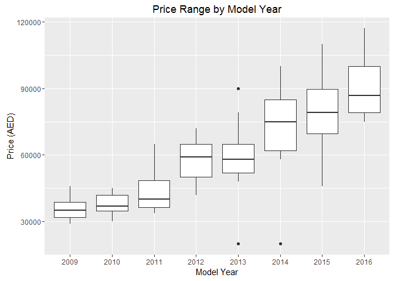
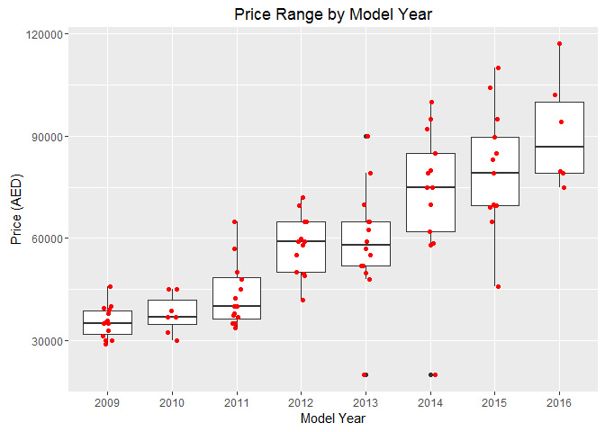
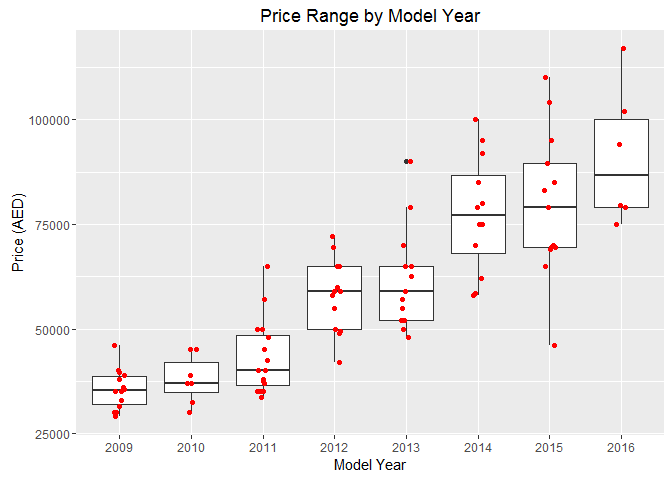
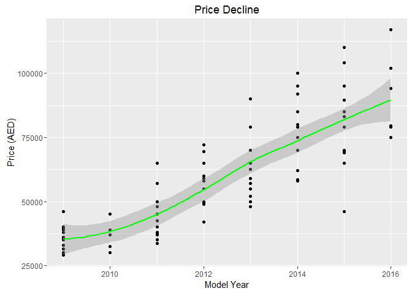
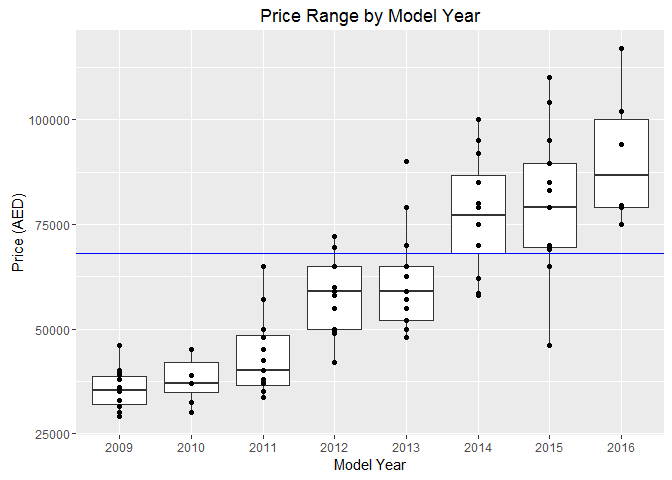

# Report - Market Price for VW Tiguan in Dubai
Steffen Ruefer  

Prior to loading the data, the libraries required for data processing and plotting should be installed and loaded (not shown in this report).
These packages are: `rvest`, `dplyr`, `ggplot2`. 


## Source Data

I surfed to a car website and filtered by the following criteria (as example):

- Car Make: Volkswagen
- Model: Tiguan

To get the maximum amount of data, I did not apply additional filters (there were plenty). When running the request, 96 cars were displayed. I copied the link of every result and pasted it into the R script, as there were only 4 pages. If there were many pages, then this would be cumbersome and a smarter way to extract the URLs would be in order, but here I skipped that. 


```r
# Enter your own links here - the show ones are only place holders
page_links <- list("http://my_favorite_car_website_here/page1",
                   "http://my_favorite_car_website_here/page2",
                   "http://my_favorite_car_website_here/page3",
                   "http://my_favorite_car_website_here/page4")
```


## Initialization

After pulling the data from the web, I initialize some vectors that I will use to store the results of the web scraping process.


```r
year <- vector(mode = "character")
kilometer <- vector(mode = "character")
price <- vector(mode = "character")
```

## Extract the raw data

I use a loop to cun through each html page to extract the data I want. To know which html nodes I am looking for, I used Chrome's "Inspect" feature. Just hover with the mouse pointer over the web element that you want to extract (for example the price), right click and select "Inspect". It will take some experimenting to get this right.


```r
# Loop through pages
for (i in 1:4) {
      
      # Save page content
      page <- read_html(page_links[[i]])
      
      # Extract car features
      content <- page %>%
            html_nodes("ul.features li") %>%
            html_text()
      
      # Extract prices
      content_price <- page %>%
            html_nodes("div#results-list div.block.item-title div.price") %>%
            html_text()
      
      # Clean the pricing data
      content_price <- trimws(gsub("\n", "", content_price))
      content_price <- gsub("AED ", "", content_price)
      content_price <- gsub(",", "", content_price)
      
      # Store price data in vector
      if (length(price) > 0) {
            price <- append(price, content_price)
      } else {
            price <- content_price
      }
      
      # Store model year data in vector
      if (length(year) > 0) {
            year <- append(year, grep("^Year:", content, value = TRUE))
      } else {
            year <- grep("^Year:", content, value = TRUE)
      }
      
      # Store kilometer data in vector
      if (length(kilometer) > 0) {
            kilometer <- append(kilometer, grep("^Kilometers:", content, value = TRUE))
      } else {
            kilometer <- grep("^Kilometers:", content, value = TRUE)
      }
}
```

## Final Data Cleansing
The resulting vectors are still of type `character` and some contain additional text. I am using regular expressions to clean them and then I convert them into numerical values.


```r
# Final Data Cleansing
year <- as.numeric(gsub("Year: ", "", year))
kilometer <- as.numeric(gsub("Kilometers: ", "", kilometer))
price <- as.numeric(price)  # Price is in AED
```

## Saving the final data set
Lastly, I saved the results into a data frame.


```r
x <- data.frame(year = year, kilometer = kilometer, price = price)
# Show data frame summary
summary(x)
```

```
##       year        kilometer          price       
##  Min.   :2009   Min.   :   100   Min.   : 20000  
##  1st Qu.:2011   1st Qu.: 29775   1st Qu.: 38975  
##  Median :2012   Median : 68500   Median : 56000  
##  Mean   :2012   Mean   : 75330   Mean   : 57911  
##  3rd Qu.:2014   3rd Qu.:110000   3rd Qu.: 70500  
##  Max.   :2016   Max.   :224000   Max.   :117000
```

## Data Visualization
As an initial plot I created a boxplot to show the price range by model year.


```r
p <- ggplot(x, aes(as.factor(year), price)) + 
      geom_boxplot() + 
      xlab("Model Year") + 
      ylab("Price (AED)") +
      ggtitle("Price Range by Model Year")
p
```



To visualize all data points, I added some jitter:


```r
p + geom_jitter(width = 0.2, color = "red")
```



The price ranges can be largely explained by model type, e.g. basic model vs. full options. Other factors like color etc. might also play a role, but this is not investigated here (not enough data points).

There are some clear outliers (2013 and 2014 model year, lowest values). The explanation for these prices is that the cars were bought on loan and the owner is asking the buyer to pay off or take over the bank loan plus a cash payment. This is distorting the data and can be quite misleading, so it is better to remove these outliers.


```r
# Check what is the lowest price
min(x$price)
```

```
## [1] 20000
```

```r
# Remove outliers by subsetting
x <- subset(x, price > 20000)
```

After that, plot again.


```r
p <- ggplot(x, aes(as.factor(year), price)) + 
      geom_boxplot() + 
      xlab("Model Year") + 
      ylab("Price (AED)") +
      geom_jitter(width = 0.2, color = "red") +
      ggtitle("Price Range by Model Year")
p
```



Obviously there is a decline in price per year, which we can visualize with a trendline.


```r
# Scatter Plot
ggplot(x, aes(year, price)) +
      geom_point() +
      geom_smooth(color = "green") +
      xlab("Model Year") +
      ylab("Price (AED)") +
      ggtitle("Price Decline")
```



What would be the value loss, in percent, over 3 years on average?


```r
# Price Decline over 3 years, on average
mean_2016 <- mean(subset(x, year == 2016, select = price)$price)
mean_2013 <- mean(subset(x, year == 2013, select = price)$price)
decline_pct <- round((mean_2016 - mean_2013) / mean_2016 * 100, 2)
decline_pct
```

```
## [1] 32.07
```

So approximately 1/3 of the value is lost over 3 years - by my experience that is optimistic and the true figure should be closer to 50%. One reason why the number is low is that the data set does not include pricing of truly new cars, so calculating the value decline is not correct.

## So what should I set as my Sell Price?
Let's say you have a 2014 model, basic configuration. It is probably realistic to assume that the value is in the lower 25% range of the 2014 model year.


```r
x2014 <- x %>% filter(year == 2014)
max_price <- quantile(x2014$price, probs = c(0.25))
print(paste0("Maximum Price: ", max_price))
```

```
## [1] "Maximum Price: 68000"
```

```r
p + geom_hline(yintercept = max_price, color = "blue")
```



The value of 68,000 AED appears high; I found a website that offers to buy used cars at a certain, calculated price, where the value of a Tiguan, Model year 2014, was evaluated at 45,000. Let's check our assumptions again.

## Review of Data Bias
Ideally, this step should have been done much earlier - however, this is an iterative process, so it's ok to do it now (we did not sell anything yet!).

My assumptions (or believes) about the data are:

- No quoted price is equivalent to a new price (because the moment a car leaves the showroom it loses value).
- Sellers tend to aim high, i.e. their price is their first negotiation position. The actual value therefore is lower.
- The price contains other factors than only the data I extracted, and I cannot be sure about their influence.
- Market price is usually not equivalent to actual selling price (there is a lot of competition!).

Let's review these assumptions and see if they can be used to adjust the price.

The first assumption is important for understanding value loss over time if the car was purchased new. It is interesting for constructing a decline curve, but it is meaningless for determining current market value.

The second assumption can be used to adjust price by using another assumption: how much lower should the actual price be set compared to the *first negotiation position*? I will assume a **15%** adjustment downwards.

The third assumption does not help due to lack of data.

The fourth assumption, similar to the second one, can be used to adjust the price downwards based on experience, or simply by making a guess. I will assume that this will drop the price by a further **5%**.


```r
# Price drop by 15%, assumption 2
max_price_1 <- max_price * (1 - 0.15)

# Price drop by another 5%, assumption 4
max_price_2 <- max_price_1 * (1 - 0.05)

print(paste0("Final Price: ", max_price_2))
```

```
## [1] "Final Price: 54910"
```

## Summary
Based on above calculations, I would assume now, within an error range, that I could sell the car for approximately 55,000 AED. There are additional factors that cause price uncertainty though, for example:

- Systematic error: limited data, market bias, etc.
- Number of kilometers: we did not include this here in the estimate.
- Additional damages to the car, like a fender bender.
- Color, new model just came out, other value perceptions.


